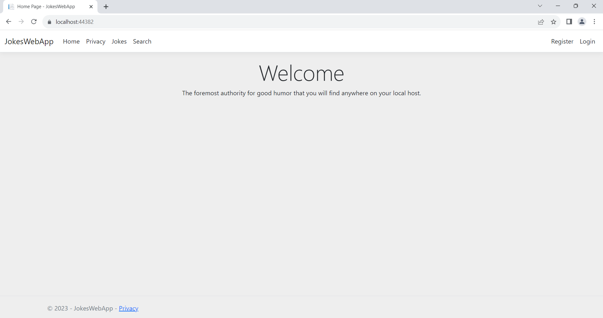
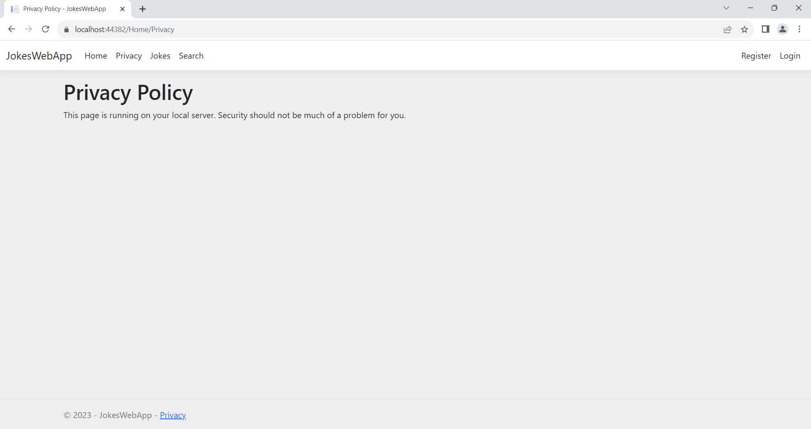
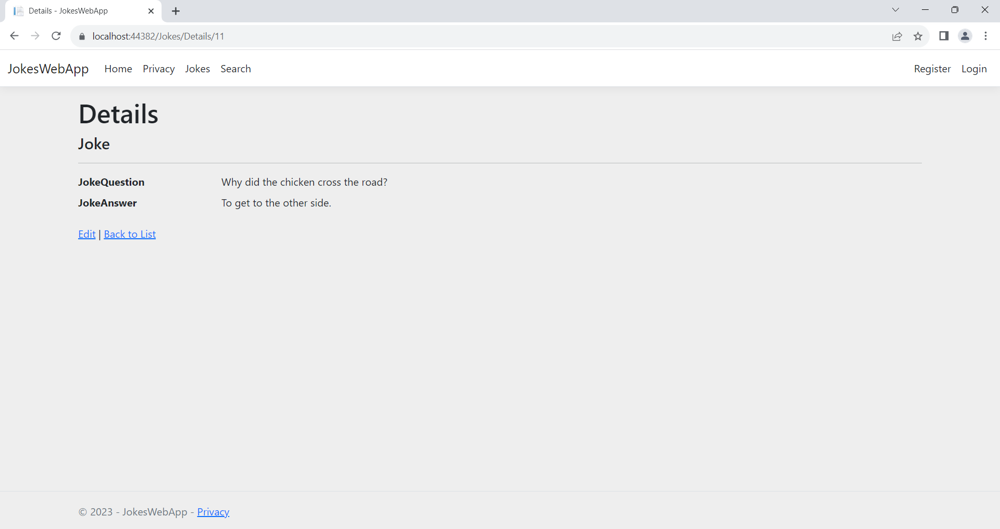
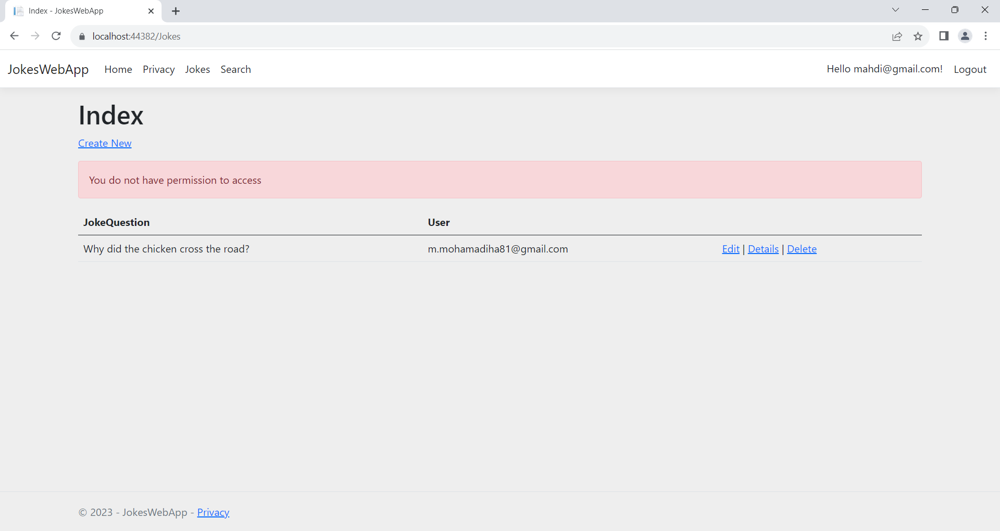

# JokesWebApp

A simple site where every user can place their jokes on the site after registering and logging in

Each user can only delete or edit their own jokes, and also each user can see the jokes of others without logging in.

# Pictures

    
    
    
    
    

